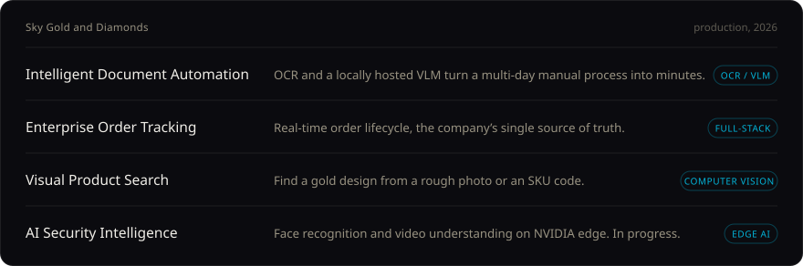

[Portfolio](https://sujal-shah-portfolio.vercel.app) &nbsp;·&nbsp; [LinkedIn](https://linkedin.com/in/sujal-shah-390154303) &nbsp;·&nbsp; [Email](mailto:sujalshah630@gmail.com)

 

I'm an AI Software Engineer at Sky Gold and Diamonds, where I own the company's AI and automation products end to end, from architecture through deployment and maintenance. I build OCR and vision-language pipelines, computer vision tools and LLM integrations with Python and the MERN stack, and I've turned multi-day manual processes into workflows that finish in minutes.

### Selected work

**Earlier projects**

- **FamilyConnect**: an AI companion for children in orphanages, built on Gemini 1.5 Pro with Next.js and Supabase. [Demo](https://orphan-companion.vercel.app/) · [Source](https://github.com/77Oshnik/FamilyConnect)
- **GreenMines**: carbon-footprint tracking and sustainability reporting for mining operations. [Demo](https://deployed-one.vercel.app/) · [Source](https://github.com/77Oshnik/GreenMines) · [Video](https://www.youtube.com/watch?v=y9yqTk89NcM)
- **Schedulr**: multi-role appointment booking with refund-safe cancellations, in Next.js and PostgreSQL. [Demo](https://odoo-appointment-booking-n5n1.vercel.app/) · [Source](https://github.com/sujal690/Odoo_Appointment_Booking) · [Video](https://youtu.be/m92FbcjDhIg)

### Toolkit

**AI**: OCR, computer vision, LLMs and VLMs, RAG, Hugging Face, inference optimization  
**Build**: Python, TypeScript, React, Next.js, Node.js, Express, MongoDB, PostgreSQL  
**Ship**: Docker, CI/CD, Vercel, Render, system design

### Activity

<b>Experience and recognition</b>

 

- **2026 to now**: AI Software Engineer, Sky Gold and Diamonds
- **2026**: B.E. Computer Science, University of Mumbai, CGPA 9.0
- **2025**: Full Stack Developer Intern, Chemtron Science Laboratories
- **2025**: 1st Place, SCOE Avishkar Project Competition
- **2024**: Grand Finalist, Smart India Hackathon (Ministry of Coal)
- **2024**: Global Nominee, NASA Space Apps Challenge

