 

  

## 🔭 What I'm up to

- 🌱 Building **GreenMines**: a platform to cut emissions in coal mining
- 🧠 Learning **System Design** and **AI integrations**
- 👯 Looking to collaborate on **open-source MERN projects**
- 🎯 Goal: solve real-world problems with tech

## 💻 Tech Stack

**Languages**

**Frameworks and Libraries**

**Databases, Cloud and Tools**

## 📊 GitHub Stats

## 🚀 Featured Projects

<table>
<tr>
<td width="33%" valign="top">

### 🔋 GreenMines
**MERN · ML · Data Viz**

Monitors and reduces carbon emissions in coal mining: carbon sink estimates, interactive dashboards, pollution-prediction AI and carbon-capture modules.

</td>
<td width="33%" valign="top">

### ✈️ TravelSafe
**Express.js · AI Chatbot · Multer**

Crowdsourced travel-safety guide with voting, comments, image uploads, an AI trip planner and route options based on real-time safety alerts.

</td>
<td width="33%" valign="top">

### 🛡️ Advanced Surveillance System
**AI · IoT · Multisensor**

AI-powered HQ defense system with laser triggers, a multilingual chatbot, facial recognition and weather-adaptive surveillance.

</td>
</tr>
</table>

### 📂 Open-source repos

## 🏆 Achievements

| | |
|---|---|
| 🛰️ **NASA Space Apps Challenge** | Global Nominee |
| 🧠 **Smart India Hackathon 2024** | Finalist |
| 🥇 **Avishkar 2025** | 1st Place |
| 👨‍🏫 **Campus Credentials** | Former DSA Python Trainer |

