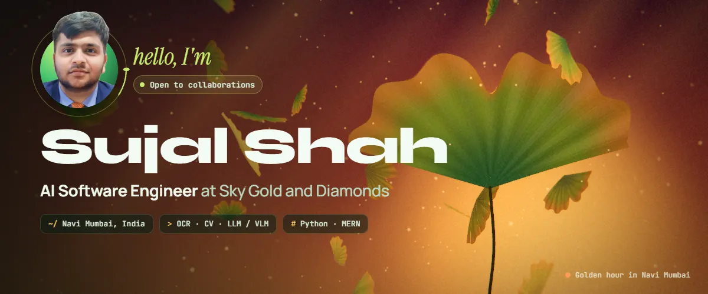

<b>Browse all public repositories</b>

 

| Repository | What it is | Stack |
|---|---|---|
| [Culturama](https://github.com/sujal690/Culturama) | My first full-stack project: temple-heritage travel app | .NET, C# |
| [Odoo_Appointment_Booking](https://github.com/sujal690/Odoo_Appointment_Booking) | Multi-role appointment booking system | Next.js, Express, PostgreSQL |
| [weapon_detection_assignment](https://github.com/sujal690/weapon_detection_assignment) | YOLOv8 weapon detection, 90.4% mAP@0.5 | Python |
| [OIBSIP](https://github.com/sujal690/OIBSIP) | Pizza delivery app with a video walkthrough | JavaScript |
| [PRODIGY_FS_01](https://github.com/sujal690/PRODIGY_FS_01), [03](https://github.com/sujal690/PRODIGY_FS_03), [04](https://github.com/sujal690/PRODIGY_FS_04), [05](https://github.com/sujal690/PRODIGY_FS_05) | Prodigy InfoTech full-stack internship tasks | JavaScript |
| [sujal-certificates](https://github.com/sujal690/sujal-certificates) | Certificates and credentials | n/a |

