

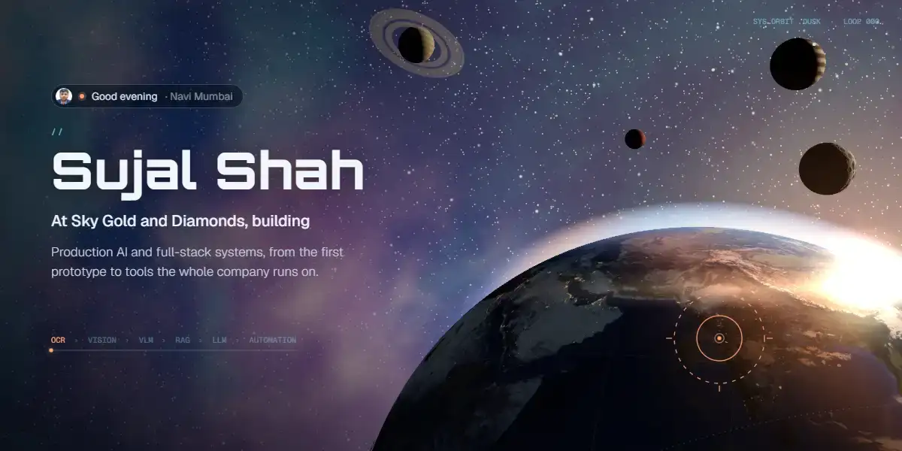




<a href="https://orphan-companion.vercel.app/"></a>
<a href="https://deployed-one.vercel.app/"></a>
<a href="https://odoo-appointment-booking-n5n1.vercel.app/"></a>

Open source: <a href="https://github.com/sujal690/Culturama">Culturama</a> · <a href="https://github.com/sujal690/Odoo_Appointment_Booking">Odoo Appointment Booking</a> · <a href="https://github.com/sujal690/weapon_detection_assignment">Weapon Detection</a>




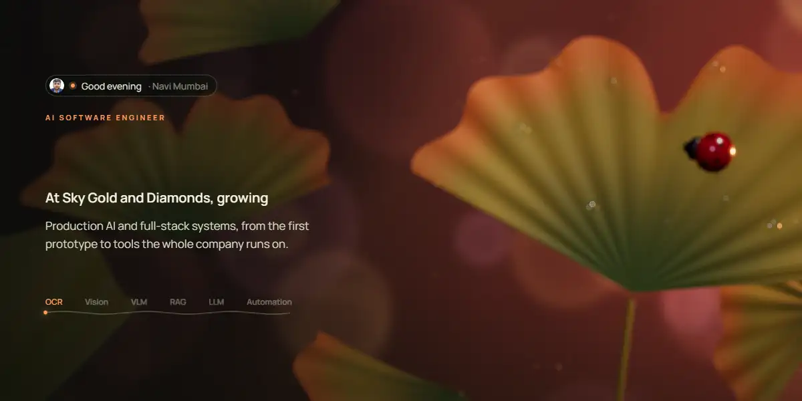




<a href="https://orphan-companion.vercel.app/"></a>
<a href="https://deployed-one.vercel.app/"></a>
<a href="https://odoo-appointment-booking-n5n1.vercel.app/"></a>

Open source: <a href="https://github.com/sujal690/Culturama">Culturama</a> · <a href="https://github.com/sujal690/Odoo_Appointment_Booking">Odoo Appointment Booking</a> · <a href="https://github.com/sujal690/weapon_detection_assignment">Weapon Detection</a>



